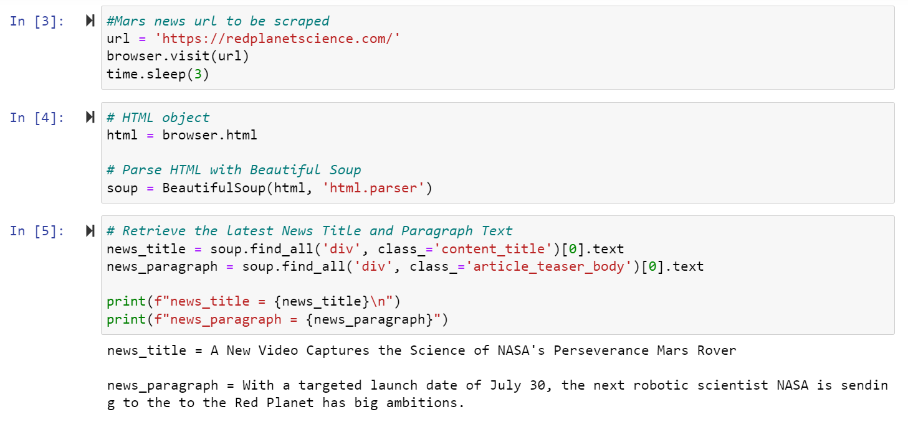
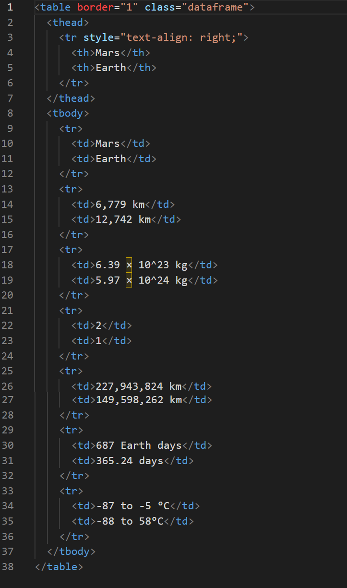
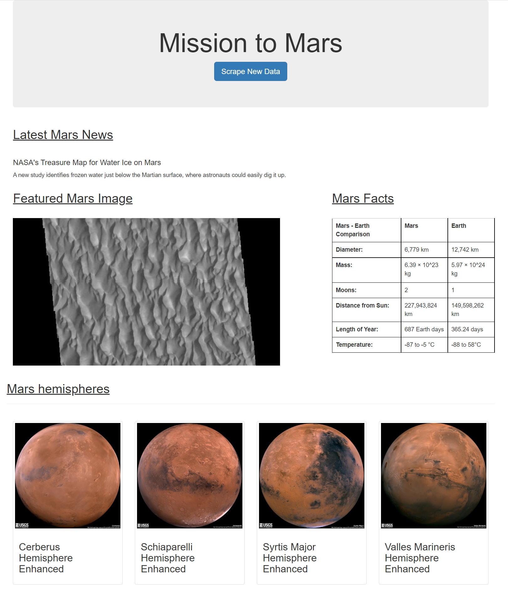

# web-scraping-challenge

In this project, a web application was built that scrapes various websites for data related to the Mission to Mars and displays the information in a single HTML page. 

There are two parts to this project: 

1. Scraping 

2. MongoDB and Flask Application

## Part  1: Scraping

Completed initial scraping using Jupyter Notebook, BeautifulSoup, Pandas, and Requests/Splinter.

* Created a Jupyter Notebook file called `mission_to_mars.ipynb`. Used this file to complete all the scraping and analysis tasks. The information below outlines what was scraped.

### NASA Mars News

* Scraped the [Mars News Site] `https://redplanetscience.com/` and collected the latest News Title and Paragraph Text. Assigned the text to variables that was referenced later.
Here is the screenshot of coding for this scraping from Jupyter Notebook.

### JPL Mars Space Images—Featured Image

* Visitd the URL for the Featured Space Image site `https://spaceimages-mars.com`.

* Used Splinter to navigate the site and found the image URL for the current Featured Mars Image, then assigned the URL string to a variable called `featured_image_url`.

* Made sure to find the image URL to the full-sized `.jpg` image.

* Made sure to save a complete URL string for this image.

### Mars Facts

* Visited the [Mars Facts webpage](https://galaxyfacts-mars.com) and used Pandas to scrape the table containing facts about the planet including diameter, mass, etc.

* Used Pandas to convert the data to a HTML table string as follows:

### Mars Hemispheres

* Visited the [astrogeology site](https://marshemispheres.com/) to obtain high-resolution images for each hemisphere of Mars.

* Clicked each of the links to the hemispheres in order to find the image URL to the full-resolution image.

* Saved the image URL string for the full resolution hemisphere image and the hemisphere title containing the hemisphere name. Used a Python dictionary to store the data using the keys `img_url` and `title`.

* Appended the dictionary with the image URL string and the hemisphere title to a list. This list will contain one dictionary for each hemisphere.

## Part 2: MongoDB and Flask Application

Used MongoDB with Flask templating to create a new HTML page that displays all the information that was scraped from the URLs above.

* Converted the Jupyter notebook into a Python script called `scrape_mars.py` by using a function called `scrape`. This function executed all the scraping code from above and returned one Python dictionary containing all the scraped data.

* Next, created a route called `/scrape` that will import `scrape_mars.py` script and called the `scrape` function.

  * Stored the return value in Mongo as a Python dictionary.

* Created a root route `/` that will query the Mongo database and pass the Mars data into an HTML template for displaying the data.

* Created a template HTML file called `index.html` that will take the Mars data dictionary and displayed all the data in the appropriate HTML elements. Used Bootstrap to structure the HTML template. Here is the final output:

